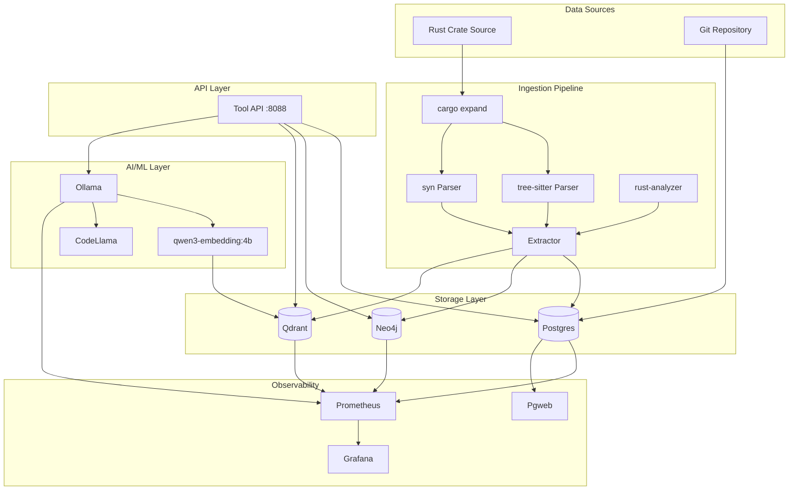
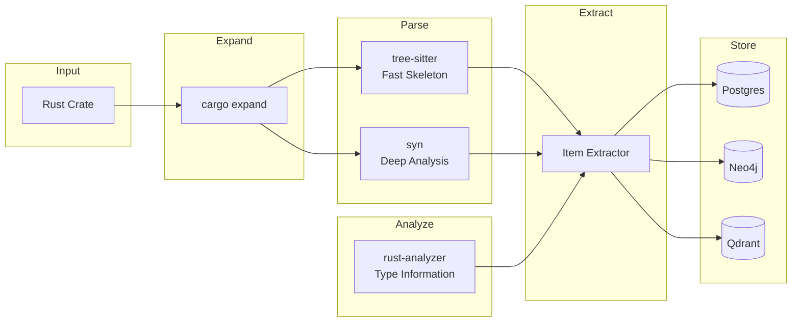
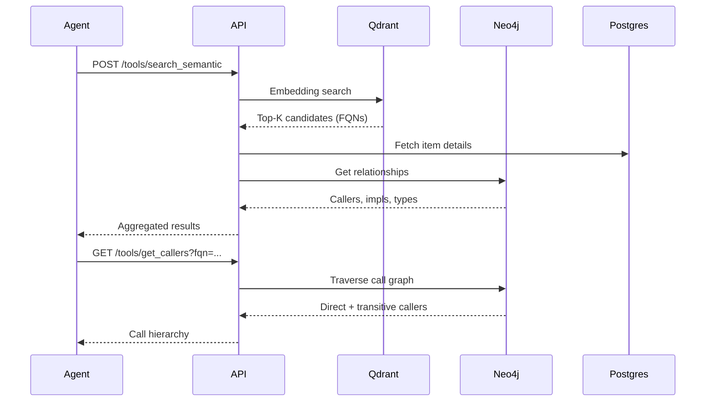
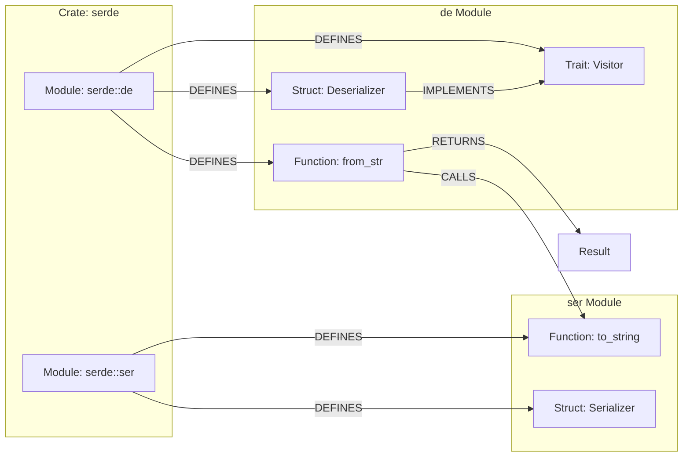

# rust-brain Architecture

Production-grade Rust code intelligence platform for semantic search, call graph traversal, trait resolution, and monomorphization tracking.

## System Overview

## Component Descriptions

### Database Layer

| Service | Image | Purpose |
|---------|-------|---------|
| **Postgres** | `postgres:16-alpine` | Raw source storage, extracted items, call sites, ingestion metadata |
| **Neo4j** | `neo4j:5-community` | Code graph: functions, structs, traits, impl relationships, call edges |
| **Qdrant** | `qdrant/qdrant:v1.12.1` | Vector embeddings for semantic code search |

### AI/ML Layer

| Service | Image | Purpose |
|---------|-------|---------|
| **Ollama** | `ollama/ollama:latest` | Local LLM inference for embeddings and code understanding |
| **qwen3-embedding:4b** | Model | 2560-dim embeddings for semantic code search |
| **CodeLlama:7b** | Model | Code understanding and generation |

### Observability Layer

| Service | Image | Purpose |
|---------|-------|---------|
| **Prometheus** | `prom/prometheus:v2.51.0` | Metrics collection and alerting |
| **Grafana** | `grafana/grafana:11.0.0` | Dashboards and visualization |
| **Postgres Exporter** | `prometheuscommunity/postgres-exporter:v0.15.0` | Postgres metrics |
| **Node Exporter** | `prom/node-exporter:v1.8.0` | Host system metrics |
| **Pgweb** | `sosedoff/pgweb:latest` | Web-based Postgres query UI |

## Data Flow

### Ingestion Pipeline

### Query Flow

## Graph Schema

### Node Types

| Label | Properties | Example |
|-------|------------|---------|
| `Crate` | `name`, `version` | `(:Crate {name: "serde", version: "1.0.190"})` |
| `Module` | `path`, `file_path` | `(:Module {path: "serde::de"})` |
| `Function` | `fqn`, `name`, `signature`, `visibility`, `start_line`, `end_line`, `generic_params`, `attributes` | `(:Function {fqn: "serde::de::from_str", name: "from_str", visibility: "pub"})` |
| `Struct` | `fqn`, `name`, `visibility`, `generic_params` | `(:Struct {fqn: "serde::de::Deserializer", name: "Deserializer"})` |
| `Enum` | `fqn`, `name`, `variants` | `(:Enum {fqn: "std::option::Option", name: "Option"})` |
| `Trait` | `fqn`, `name`, `methods` | `(:Trait {fqn: "serde::Serialize", name: "Serialize"})` |
| `Impl` | `fqn`, `trait_fqn`, `self_type`, `generic_params` | `(:Impl {trait_fqn: "serde::Serialize", self_type: "User"})` |
| `TypeAlias` | `fqn`, `name`, `target_type` | `(:TypeAlias {fqn: "std::io::Result", name: "Result"})` |
| `Const` | `fqn`, `name`, `type`, `value` | `(:Const {fqn: "std::f64::consts::PI", name: "PI", type: "f64"})` |
| `Static` | `fqn`, `name`, `type`, `visibility`, `is_mutable` | `(:Static {fqn: "my_crate::GLOBAL_STATE", name: "GLOBAL_STATE", is_mutable: true})` |
| `Macro` | `fqn`, `name`, `macro_type`, `visibility` | `(:Macro {fqn: "serde::Serialize", name: "Serialize", macro_type: "derive"})` |
| `Type` | `fqn`, `name`, `kind` | `(:Type {fqn: "std::vec::Vec<T>", name: "Vec", kind: "generic"})` |

### Relationship Types

| Relationship | From → To | Properties | Example |
|--------------|-----------|------------|---------|
| `CONTAINS` | Crate → Module | - | `(:Crate)-[:CONTAINS]->(:Module)` |
| `DEFINES` | Module → Function/Struct/Enum/Trait | - | `(:Module)-[:DEFINES]->(:Function)` |
| `CALLS` | Function → Function | `file_path`, `line`, `concrete_types`, `is_monomorphized` | `(:Function {fqn: "main"})-[:CALLS {line: 42}]->(:Function {fqn: "process"})` |
| `IMPLEMENTS` | Impl → Trait | - | `(:Impl)-[:IMPLEMENTS]->(:Trait)` |
| `FOR_TYPE` | Impl → Struct | - | `(:Impl)-[:FOR_TYPE]->(:Struct)` |
| `HAS_PARAM` | Function → Struct/Enum/Trait | `position`, `name` | `(:Function)-[:HAS_PARAM {position: 0}]->(:Struct)` |
| `RETURNS` | Function → Struct/Enum/Trait | - | `(:Function)-[:RETURNS]->(:Enum {fqn: "std::result::Result"})` |
| `IMPORTS` | Module → Module | `alias` | `(:Module)-[:IMPORTS {alias: "fmt"}]->(:Module)` |
| `FOR` | Impl → Struct/Enum | - | `(:Impl)-[:FOR]->(:Struct {fqn: "User"})` |
| `HAS_VARIANT` | Enum → Struct/Enum | `name`, `discriminant` | `(:Enum {fqn: "Option"})-[:HAS_VARIANT {name: "Some"}]->(:Struct)` |

### Example Graph

## Database Schemas

### Postgres Tables

#### `source_files`
| Column | Type | Description |
|--------|------|-------------|
| `id` | UUID | Primary key |
| `crate_name` | TEXT | Crate identifier |
| `module_path` | TEXT | Full module path |
| `file_path` | TEXT | Filesystem path |
| `original_source` | TEXT | Raw Rust source |
| `expanded_source` | TEXT | Macro-expanded source |
| `git_hash` | TEXT | Git commit hash |
| `git_blame` | JSONB | Line-level blame info |

#### `extracted_items`
| Column | Type | Description |
|--------|------|-------------|
| `id` | UUID | Primary key |
| `source_file_id` | UUID | FK to source_files |
| `item_type` | ENUM | function, struct, enum, trait, impl, type_alias, const, static, macro, module |
| `fqn` | TEXT | Fully qualified name (unique) |
| `name` | TEXT | Short name |
| `visibility` | TEXT | pub, pub(crate), private |
| `signature` | TEXT | Full signature |
| `doc_comment` | TEXT | Documentation |
| `start_line` / `end_line` | INT | Source location |
| `body_source` | TEXT | Function/method body |
| `generic_params` | JSONB | Type parameters |
| `attributes` | JSONB | #[derive], #[cfg], etc. |

#### `call_sites`
| Column | Type | Description |
|--------|------|-------------|
| `id` | UUID | Primary key |
| `caller_fqn` | TEXT | Calling function |
| `callee_fqn` | TEXT | Called function |
| `file_path` | TEXT | Source file |
| `line_number` | INT | Call location |
| `concrete_type_args` | JSONB | Monomorphization types |
| `is_monomorphized` | BOOLEAN | Generic instantiation |

### Qdrant Collections

#### `code_embeddings`
| Payload Field | Type | Description |
|---------------|------|-------------|
| `fqn` | keyword | Fully qualified name |
| `crate_name` | keyword | Source crate |
| `module_path` | keyword | Module path |
| `item_type` | keyword | function, struct, etc. |
| `visibility` | keyword | pub/private |
| `file_path` | keyword | Source file |
| `has_generics` | bool | Has type parameters |

Vector config: 2560 dimensions (qwen3-embedding:4b), Cosine distance

#### `doc_embeddings`
| Payload Field | Type | Description |
|---------------|------|-------------|
| `source_fqn` | keyword | Source item FQN |
| `content_type` | keyword | doc_comment, example, error_doc |
| `crate_name` | keyword | Source crate |

## Key Design Decisions

### 1. Triple Storage Architecture

**Decision:** Use three specialized databases (Postgres, Neo4j, Qdrant) instead of a single general-purpose database.

**Rationale:**
- **Postgres** excels at relational queries, ACID transactions, and structured metadata
- **Neo4j** provides native graph traversal for call hierarchies and type relationships
- **Qdrant** offers efficient vector similarity search for semantic queries

**Trade-off:** Increased operational complexity vs. query performance. Each DB is optimized for its workload.

### 2. Dual Parsing Strategy

**Decision:** Use both tree-sitter and syn for parsing.

**Rationale:**
- **tree-sitter** is fast and produces an incremental parse tree—ideal for skeleton extraction
- **syn** provides deep semantic analysis with full type information

**Trade-off:** Increased processing time vs. accuracy. Use tree-sitter for quick scans, syn for deep analysis.

### 3. Lazy Monomorphization

**Decision:** Store generic functions as-is, index concrete call sites, resolve on query.

**Rationale:**
- Avoids exponential blowup from fully expanding all generic instantiations
- Call sites record concrete type arguments for resolution
- Query time resolution allows flexible analysis

**Trade-off:** Query complexity vs. storage efficiency.

### 4. Local AI with Ollama

**Decision:** Use Ollama for all AI/ML workloads instead of cloud APIs.

**Rationale:**
- **Privacy:** Code never leaves the machine
- **No external dependencies:** Works offline
- **Cost:** No per-token API charges
- **Latency:** No network round-trips

**Trade-off:** Hardware requirements (8GB+ RAM, GPU recommended) vs. cloud convenience.

### 5. Monorepo-First FQN Scheme

**Decision:** Use fully qualified names that include crate and module path.

**Rationale:**
- Supports multi-repo analysis without schema changes
- Natural namespace isolation
- Clear provenance for each item

**Format:** `crate_name::module_path::item_name`

## Resource Allocation

| Service | Memory Limit | Notes |
|---------|--------------|-------|
| Postgres | 6 GB | Tunable based on dataset |
| Neo4j | 12 GB | Heap + pagecache configured |
| Qdrant | 12 GB | Vector index storage |
| Ollama | 16 GB | Model loading + inference (GPU recommended) |
| API | 1 GB | Tool API service |
| MCP SSE | 256 MB | MCP streaming transport |
| OpenCode | 512 MB | IDE integration |
| Grafana | 512 MB | Dashboards |
| Ingestion | 32 GB | Pipeline (runs on demand via profile) |

**Total minimum:** ~48 GB RAM for full stack (less without ingestion and observability)
